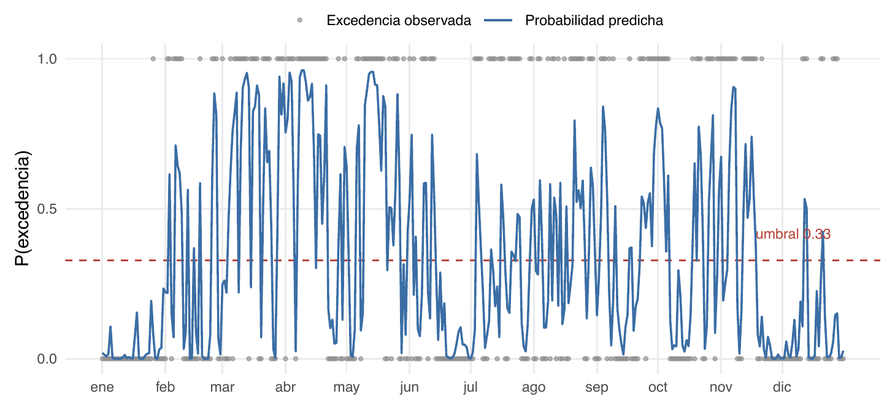
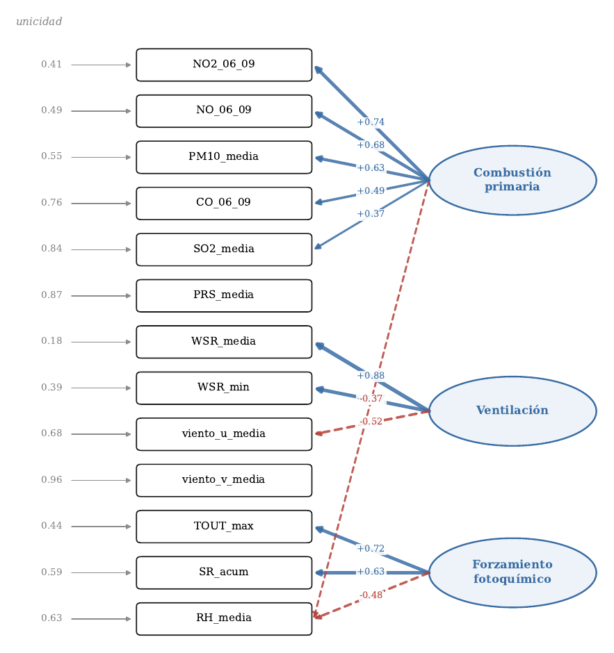
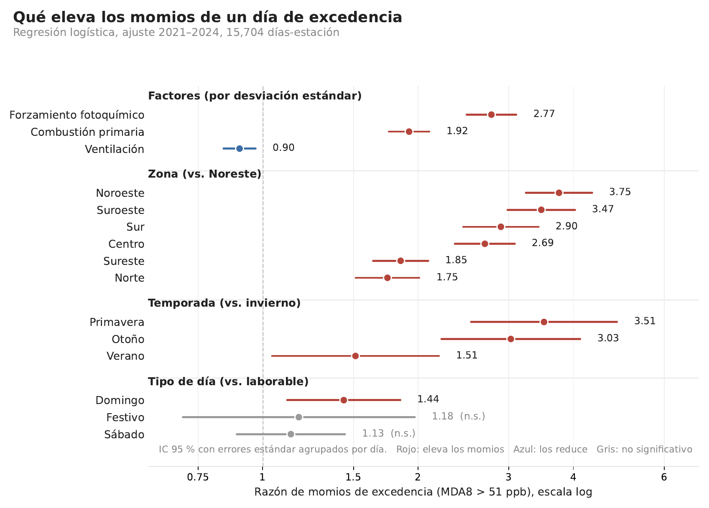
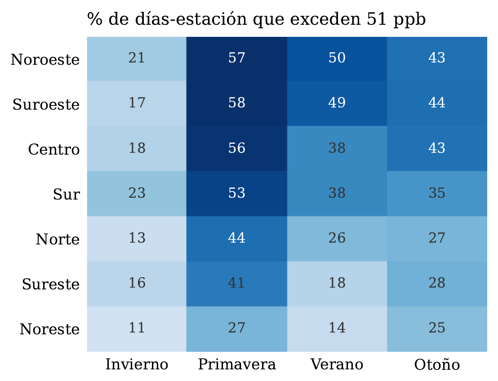
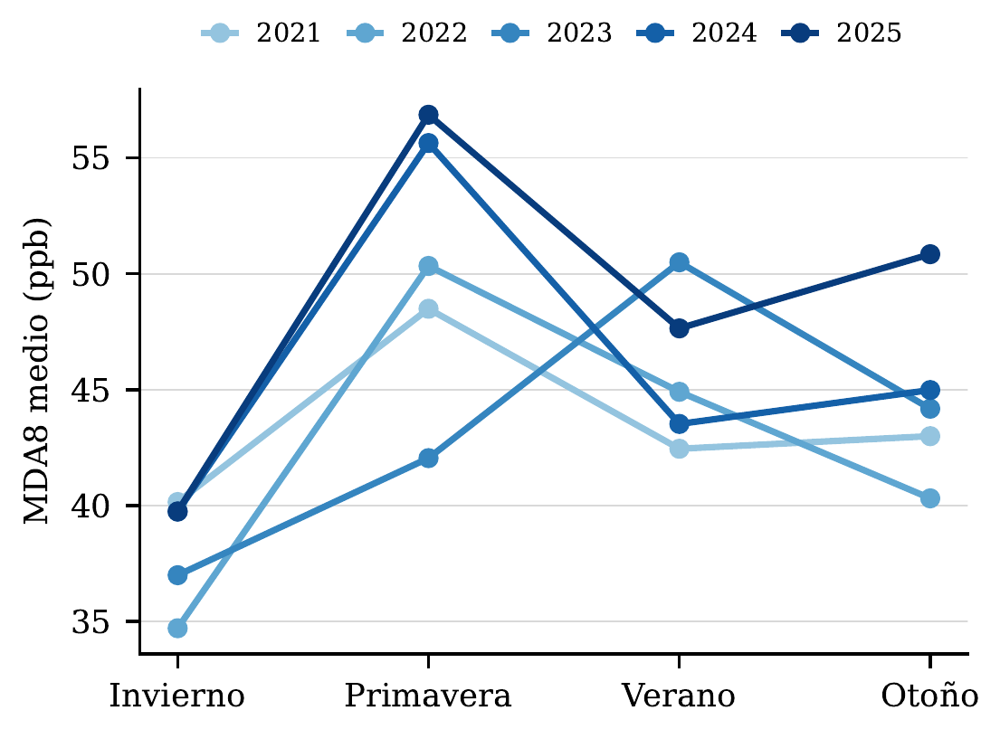
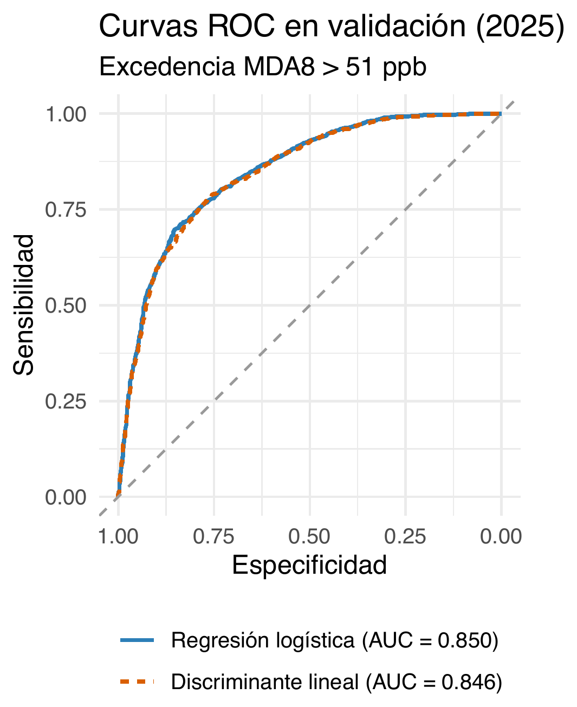
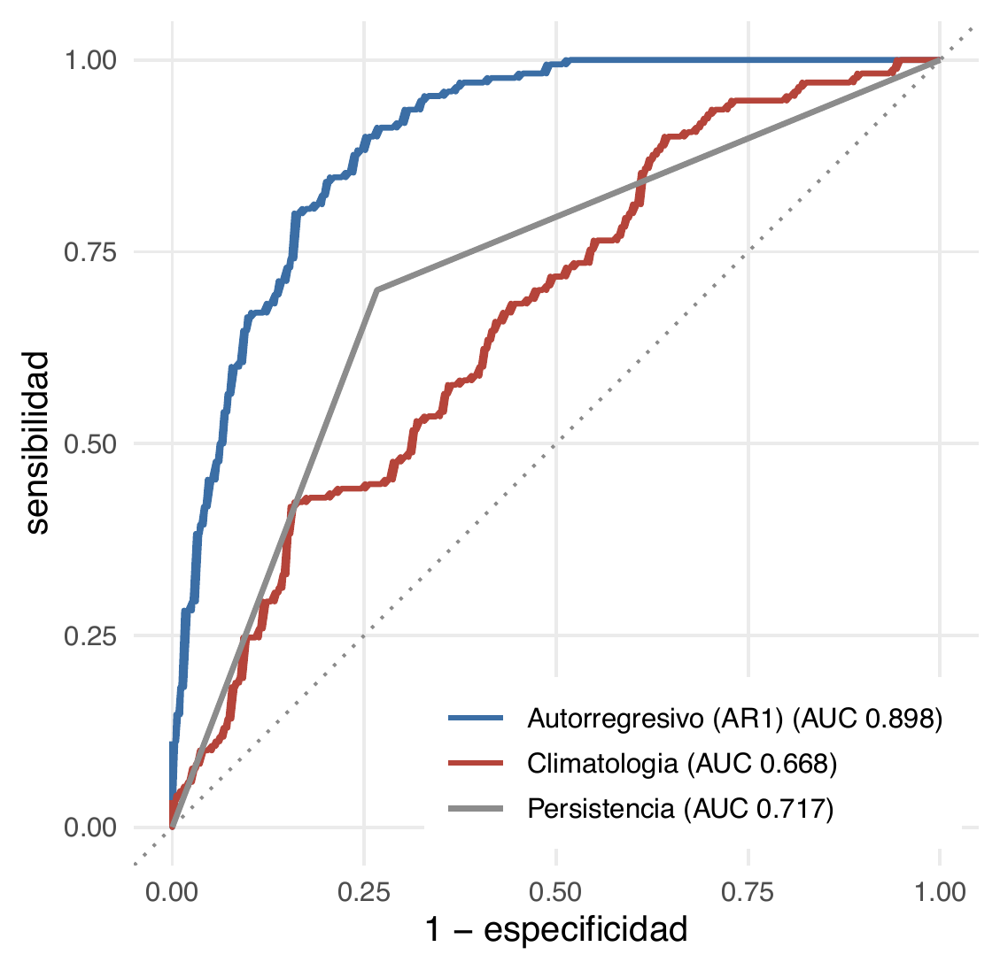
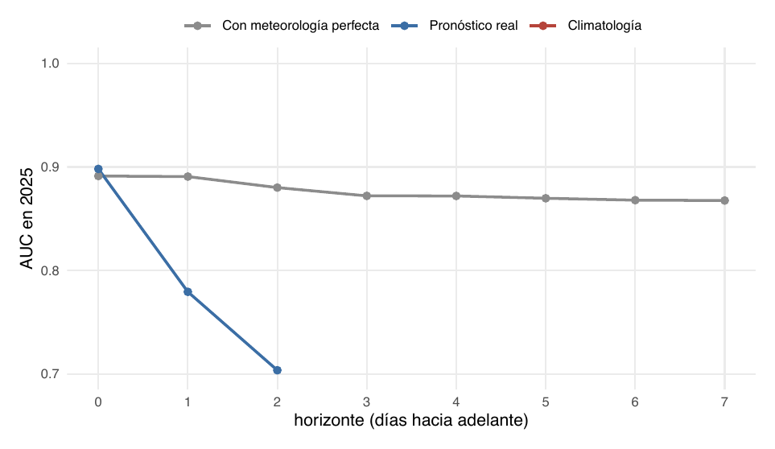
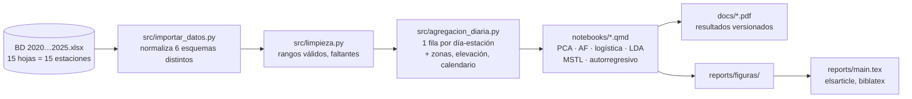

<div align="center">

# 🌫️ Ozono en Monterrey: ¿qué días se excede el umbral?

**Análisis multivariado de 5 años de mediciones del SIMA para discriminar y anticipar las excedencias de ozono en el Área Metropolitana de Monterrey**

[](requirements.txt)
[](renv.lock)
[](notebooks/)
[](reports/)
[](tests/)
[](#-equipo)



*Probabilidad diaria de excedencia (azul) contra los días en que realmente se excedió (puntos), sobre el año 2025 que el modelo nunca vio.*

</div>

---

## 📌 En una mirada

| | |
|---|---|
| **Pregunta** | ¿Con la meteorología y los contaminantes primarios de un día, se puede saber en qué estaciones el ozono superará los **51 ppb** (MDA8) de la NOM-020-SSA1-2021? |
| **Datos** | **640,583** registros horarios · **15 estaciones** del SIMA · 2021 → 2025 · **26,691** días-estación |
| **Técnicas** | PCA · Análisis factorial · Regresión logística · Análisis discriminante lineal · Descomposición MSTL · Modelo autorregresivo |
| **Resultado** | AUC **0.850** al clasificar excedencias en 2025 con datos del mismo día; **0.898** al incorporar el día anterior; **0.779** pronosticando a un día |
| **Hallazgo** | La **primavera** y el **forzamiento fotoquímico** (calor + radiación solar) pesan más que cualquier contaminante primario |

---

## 🔬 El problema

El ozono troposférico es el ingrediente principal del *smog*. No se emite: se **forma** cuando los óxidos de nitrógeno y los compuestos orgánicos volátiles reaccionan con calor y luz solar. Monterrey lo tiene todo para producirlo: tráfico, industria, sol intenso y un valle rodeado de sierras que atrapa el aire.

En **casi 1 de cada 3 días-estación** (31.96 %) de 2021–2025, el máximo diario de la media móvil de 8 horas superó los 51 ppb que marca la norma mexicana. Este proyecto pregunta qué condiciones distinguen esos días y hasta qué punto se pueden anticipar.

---

## 📊 Qué encontramos

### 1. Quince predictores se resumen en tres "ejes físicos"

El análisis de componentes principales y el factorial coinciden: las variables meteorológicas y de contaminantes del día colapsan en **tres factores** con lectura física clara, que además se mantienen estables fuera del periodo de ajuste (congruencia de Tucker 0.97 / 0.94 / 0.92 en 2025).

<div align="center">

</div>

| Factor | Qué agrupa | Lectura |
|---|---|---|
| 🏭 **Combustión primaria** | NO₂, NO, CO, PM10, SO₂ matutinos | Lo que emiten tráfico e industria |
| 💨 **Ventilación** | Velocidad del viento (media, mínima, componentes u/v) | Capacidad del valle para dispersar |
| ☀️ **Forzamiento fotoquímico** | Temperatura máxima, radiación solar acumulada, humedad | La "energía" para cocinar ozono |

### 2. Qué eleva los momios de un día de excedencia

<div align="center">

</div>

- El **forzamiento fotoquímico multiplica los momios por 2.77** por cada desviación estándar; la combustión primaria por 1.92. Más viento (ventilación) los reduce.
- La **primavera** eleva los momios **3.5×** respecto al invierno; el **noroeste** del área metropolitana **3.75×** respecto al noreste. La excedencia es tanto un fenómeno de calendario y geografía como de química.
- Del calendario laboral, solo el **domingo** tiene un efecto claro (1.44×); sábados y festivos no se distinguen de un día laborable.

<div align="center">


</div>

### 3. Logística y discriminante: empate técnico

Dos modelos ajustados sobre 2021–2024 y evaluados sobre 2025 (un año que resultó ser el de más ozono de la serie). Ambos superan por mucho el criterio de logro de 0.75; la diferencia entre ellos es estadísticamente detectable (DeLong p = 0.0002) pero sin consecuencia práctica: **coinciden en el 93.8 % de las clasificaciones**.

<div align="center">

</div>

| Modelo | AUC (2025) | Sensibilidad | Especificidad |
|---|:-:|:-:|:-:|
| Regresión logística | **0.850** | 0.698 | 0.853 |
| Discriminante lineal | 0.846 | 0.758 | 0.788 |

### 4. El ozono tiene memoria: nowcasting y pronóstico

Descomponiendo las series con **MSTL** aparecen un ciclo semanal (más fuerte en la combustión primaria: el tráfico entre semana) y uno anual (más fuerte en el forzamiento fotoquímico). Aprovechar esa autocorrelación con un término autorregresivo mejora el modelo:

<div align="center">


</div>

- **Nowcasting** (meteorología de hoy + excedencia de ayer): AUC **0.898**, contra 0.668 de la climatología y 0.717 de "mañana será como hoy".
- **Pronóstico a un día** sin conocer la meteorología del día siguiente: AUC **0.779** vs 0.667 de climatología (p < 10⁻⁴). A dos días cae a 0.704 y de ahí ya no aporta sobre el calendario.
- Con **meteorología perfecta** el techo es 0.868 a 7 días: el límite no está en el modelo sino en no saber el clima de mañana.

### 5. Lo que probamos y descartamos

Un análisis honesto documenta lo que no funcionó y por qué. En el reporte se justifica el rechazo del **análisis paralelo de Horn** (retiene 7 factores por artefacto del tamaño muestral), la **extracción por máxima verosimilitud** (los datos no son normales ni después de Box-Cox), la **rotación oblicua** (reintroduce la colinealidad que el factorial vino a resolver) y dos variables con **casos Heywood**.

> ⚠️ **Límite honesto:** el SIMA no mide compuestos orgánicos volátiles, así que los factores se interpretan como *condiciones asociadas*, no como mecanismo químico. Y las 15 estaciones de un mismo día comparten el clima, por lo que las filas día-estación no son independientes; los AUC de validación no lo resienten, los errores estándar sí.

---

## 🛠️ Del Excel al reporte



Los seis Excel anuales del SIMA **no comparten estructura**: 2024 pega las unidades al encabezado (`CO (ppm)`), 2025 renombra la fecha a `date` y mete una fila de unidades, y el número de estaciones va de 13 a 15. Cada hoja es una estación sin columna que lo diga. `src/importar_datos.py` normaliza todo eso con pruebas en `tests/`; no leas los Excel a mano.

### Decisiones de ingeniería que importan

- **Sin fuga de información.** El PCA y el factorial se ajustan solo con 2021–2024; 2025 es validación pura y nunca entra al ajuste.
- **Quarto en vez de notebooks.** Los `.qmd` son la fuente (solo código y texto, se diffean como cualquier `.py`) y los PDF en `docs/` son los resultados. Sin `.ipynb` con outputs en base64 peleando en cada merge.
- **Reporte modular en LaTeX.** Cada sección es un archivo en `reports/secciones/`; `main.tex` solo hace `\input`. Cinco personas escribiendo sin pisarse.
- **Marcas de tiempo en hora local de pared.** Sin zona horaria; desde R se declara `tzone = "UTC"` para no correr 6 horas.

---

## 📁 Estructura del repositorio

```
data/          raw/ (Excel del SIMA, inmutables) y processed/ (generado, casi todo ignorado por git)
src/           pipeline en Python (importar_datos, limpieza, agregacion_diaria, factorial) y cargar_datos.R
notebooks/     análisis en Quarto (.qmd): la fuente, sin resultados
docs/          PDFs renderizados de los .qmd + documentación de datos y de referencia
reports/       reporte en LaTeX (main.tex, secciones/, figuras/, references.bib)
presentations/ avances presentados al socioformador
tests/         pruebas de pytest del código de src/
assets/        figuras en PNG para este README
archive/       análisis que se descartaron y se conservan como historia
```

La documentación de los datos (inconsistencias entre años, faltantes por parámetro, diccionario) está en [`data/README.md`](data/README.md) y en [`docs/`](docs/). Cada análisis tiene su PDF: [verificación de calidad](docs/01_verificacion_calidad.pdf) · [EDA cualitativo](docs/04_eda_cualitativas.pdf) · [estacionalidad](docs/05_estacionalidad_ozono.pdf) · [correlación](docs/06_correlacion_diaria.pdf) · [PCA](docs/07_pca.pdf) · [factorial](docs/09_extraccion_factorial.pdf) · [discriminante](docs/analisis_discriminante.pdf) · [series de tiempo](docs/serie_tiempo_factores.pdf) · [autorregresivo](docs/autorregresivo_logistico.pdf) · [pronóstico](docs/pronostico_excedencia.pdf).

---

## 🚀 Reproducir el análisis

<details>
<summary><b>Entornos (Python y R coexisten)</b></summary>

**Python** — entorno virtual y `requirements.txt` (pandas, numpy, scipy, scikit-learn, statsmodels, factor_analyzer, matplotlib, openpyxl, pyarrow, pytest):

```bash
python3 -m venv venv
source venv/bin/activate
pip install -r requirements.txt
```

Si un análisis necesita una librería nueva, instálala y actualiza `requirements.txt` con `pip freeze`: ese archivo es el contrato del equipo.

**R** — gestionado con **renv** (`renv.lock`, R 4.6.1; tidyverse, readxl, ggplot2, googlesheets4). El `.Rprofile` activa renv al abrir la sesión:

```r
renv::restore()                 # instalar lo que falte según renv.lock
renv::install("paquete")        # agregar una dependencia nueva...
renv::record("paquete@1.2.3")   # ...y registrarla en el lockfile
```

> **No corras `renv::snapshot()`.** El lockfile está en modo `implicit`, así que snapshot lo recorta a los paquetes citados en el código y borra los ~100 restantes. Para agregar dependencias, `install()` + `record()`.

**Codespaces (sin instalación local).** `.devcontainer/` deja el repo listo para abrirse en GitHub Codespaces con LaTeX (`latexmk`, `biber`, `elsarticle`), Python y R. Al crear el Codespace, el `postCreateCommand` crea el entorno `.venv`, instala `requirements.txt` y corre `renv::restore(prompt = FALSE)` (nunca `snapshot()`).

</details>

<details>
<summary><b>Pipeline de datos</b></summary>

`data/processed/` no se versiona (salvo los datasets finales que sí están commiteados), así que se regenera:

```bash
source venv/bin/activate
python src/importar_datos.py      # consolida los BD <anio>.xlsx (~5 min) -> sima_horario.parquet
python src/limpieza.py            # -> sima_limpio_horario.csv / sima_limpio_diario.csv
python src/agregacion_diaria.py   # una fila por día-estación -> sima_diario_modelado.parquet
```

Desde R, `source("src/cargar_datos.R")` carga el mismo dataframe con las marcas de tiempo ya declaradas como hora local de pared.

</details>

<details>
<summary><b>Análisis: Quarto, no notebooks</b></summary>

Los análisis se escriben en **`.qmd`**, no en `.ipynb`: un notebook es JSON con outputs en base64 que no se diffea ni se mergea, y un `.qmd` se revisa como cualquier archivo de código.

De ahí sale la regla: **la fuente no lleva resultados, el PDF sí.** El `.qmd` solo tiene código y texto; los resultados viven en el PDF renderizado, que se versiona en `docs/` porque sin él nadie puede revisar la PR sin re-ejecutar el pipeline completo.

```bash
quarto render notebooks/07_pca.qmd     # -> docs/07_pca.pdf
quarto render notebooks                # renderiza todos los .qmd del proyecto
```

El motor es `jupyter: python3` y necesita `ipykernel`, `nbclient`, `nbformat` y `pyyaml` en el entorno (ya están en `requirements.txt`); si falta `pyyaml`, el error es un `ModuleNotFoundError: No module named 'yaml'` que parece un bug de Quarto y no lo es.

</details>

<details>
<summary><b>Pruebas</b></summary>

```bash
source venv/bin/activate
pytest -v
pytest -v -m "not lento"     # salta las que abren los Excel de data/raw/
```

La configuración vive en `pytest.ini` en la raíz, así que `pytest` a secas funciona desde cualquier carpeta.

</details>

<details>
<summary><b>Reporte en LaTeX</b></summary>

El reporte vive en [`reports/`](reports/) y se compila desde esa carpeta con `latexmk` a secas: el `.latexmkrc` ya fija el modo PDF y biber, así que no hacen falta flags. Cada sección es un archivo en `reports/secciones/` que `main.tex` inserta con `\input`; las figuras van en `reports/figuras/`, preferentemente en PDF. El detalle está en el [`README` de `reports/`](reports/README.md) y en la [guía de estilo](reports/guia-estilo.md).

```bash
cd reports
latexmk        # -> main.pdf
latexmk -c     # limpia auxiliares
```

</details>

---

## 👥 Equipo

Proyecto del curso **MA2003B — Aplicación de Métodos Multivariados en Ciencia de Datos**, Tecnológico de Monterrey, grupo 102, equipo 7.

**Eduardo Luna · Jenaro Alcaraz · Emilia Rico · Mar Fernández · Sofía Fernández**

Datos: [Sistema Integral de Monitoreo Ambiental (SIMA)](https://aire.nl.gob.mx/), Secretaría de Medio Ambiente de Nuevo León.

## 🤝 Cómo colaborar

Todo el flujo de trabajo del equipo (issues, branches, commits, Pull Requests, el uso de Claude en GitHub y las reglas para escribir el reporte sin pisarse) está en [`CONTRIBUTING.md`](CONTRIBUTING.md). Léelo antes de tu primer commit.
